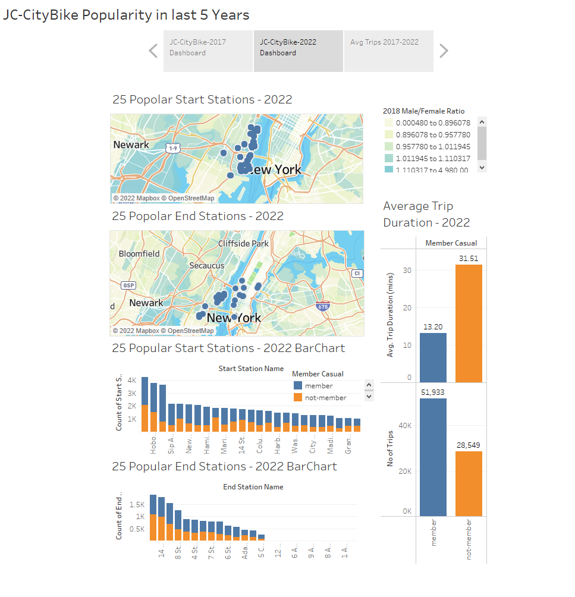
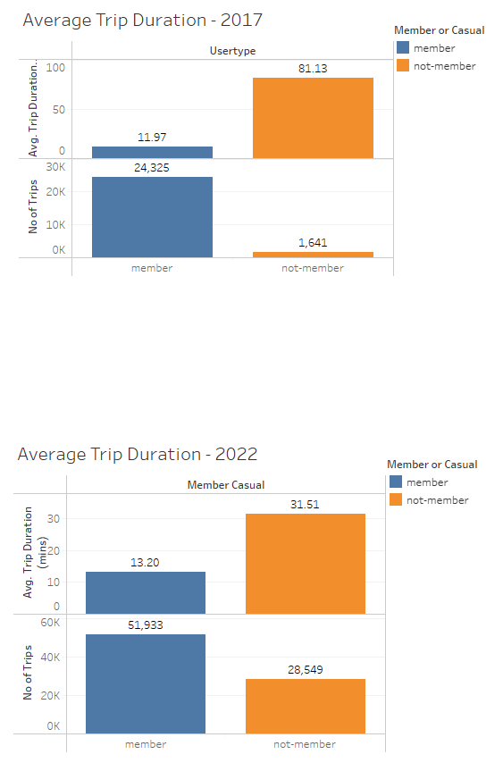

# Citi Bike Trip Visualization with Tableau
Access the tableau public workbook below to see the change in bike rides from 2017 to 2022.
[Tableau Public Workbook](https://public.tableau.com/authoring/CitiBike-Analysis_16670429497860/JC-CityBikePopularityinlast5Years#2). This workbook consits of 1 Story and 3 Dashboards.
This workbook compares the city bike data from year 2017 and year 2022. Few of the question that we tried to answer here are:
* Change in number of rider
* Change in number of subscribed rider
* Change in popular end and start stations 

## Obesrvations
* Total number of riders have increased from approx 26K in 2017 to about 80K in 2022
* Number of member(subscribed riders) have doubled in 5 years
* Average trip duration for members have also increased along with increase in number of member riders
* Popular end stations are not localized in Jersey City like it was in 2017. Now we can see some popular stations in Manhattan area

## Images

